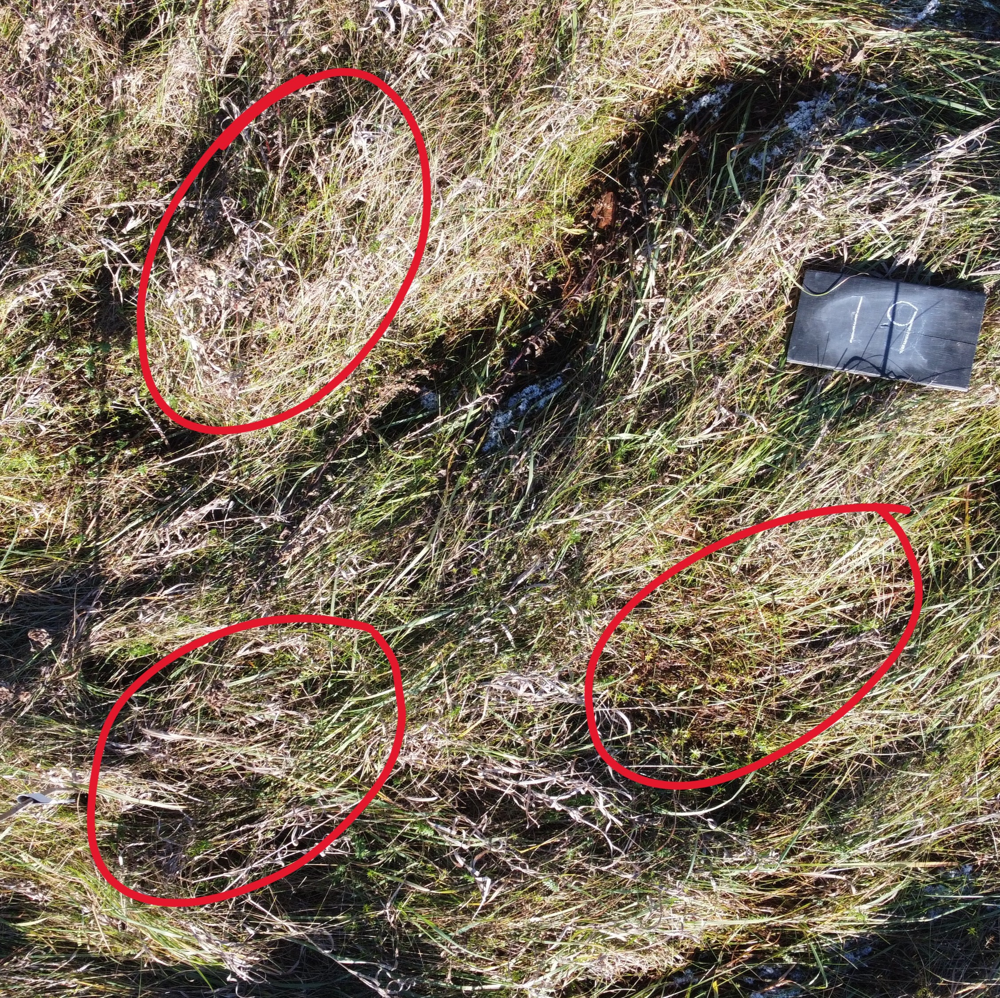
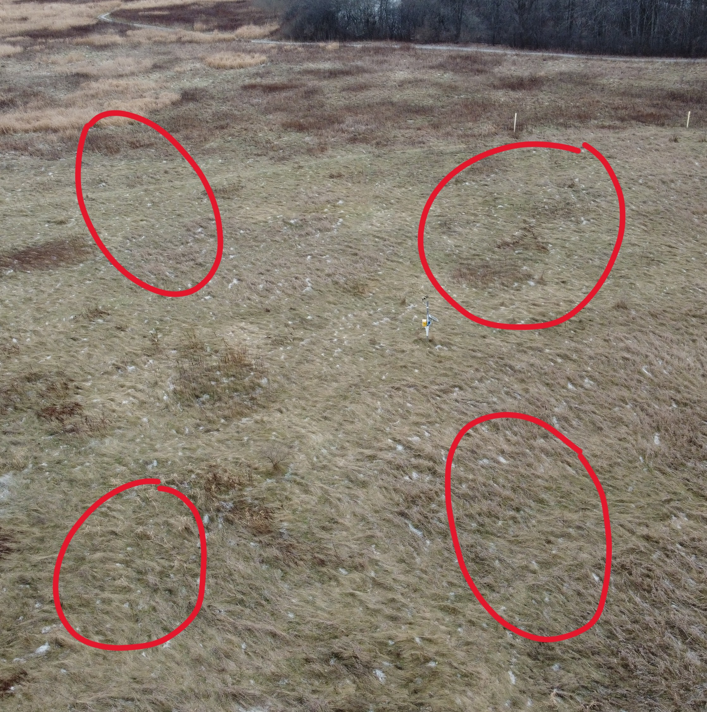
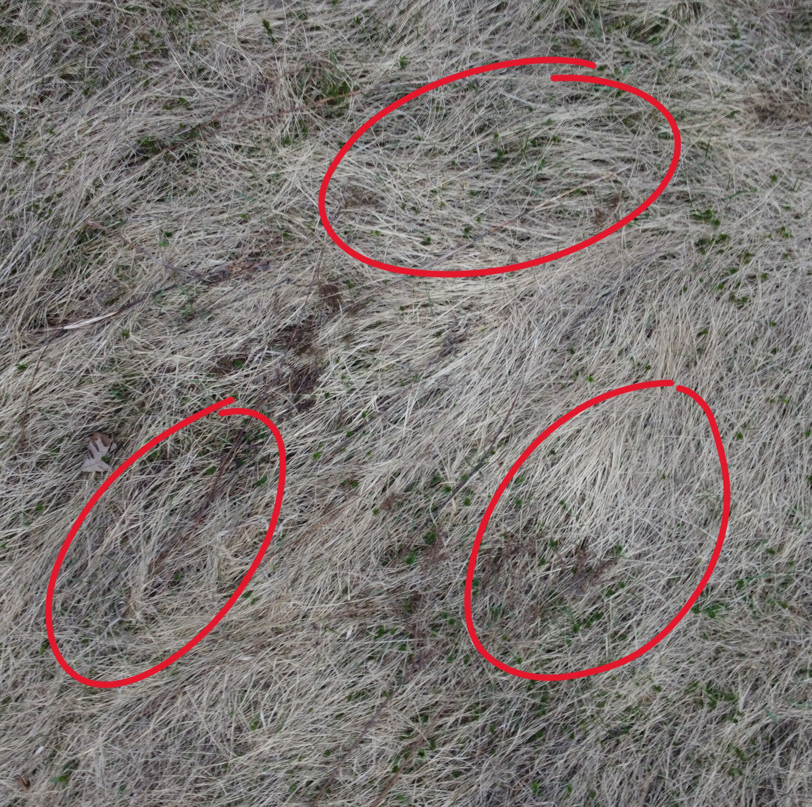
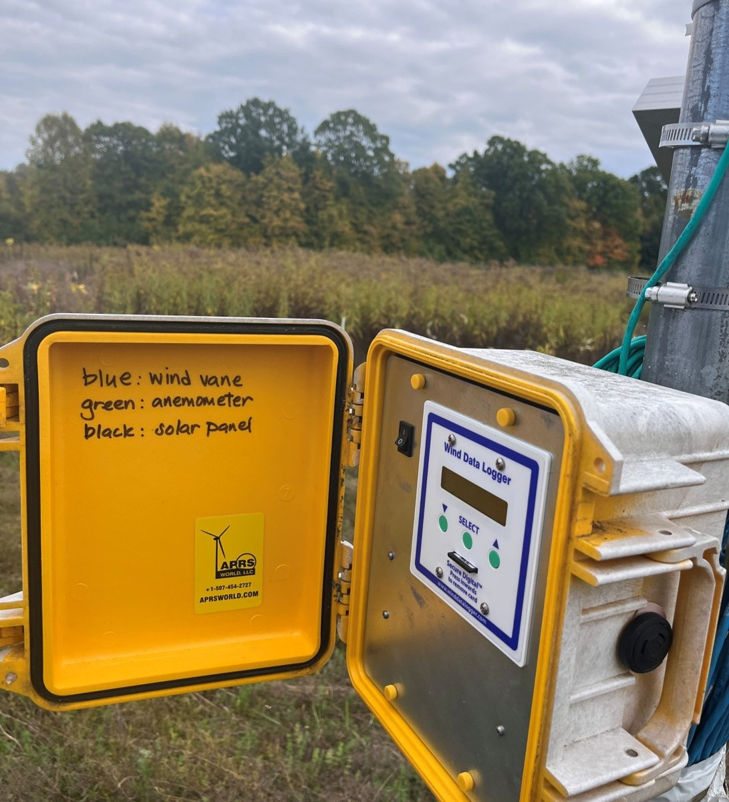
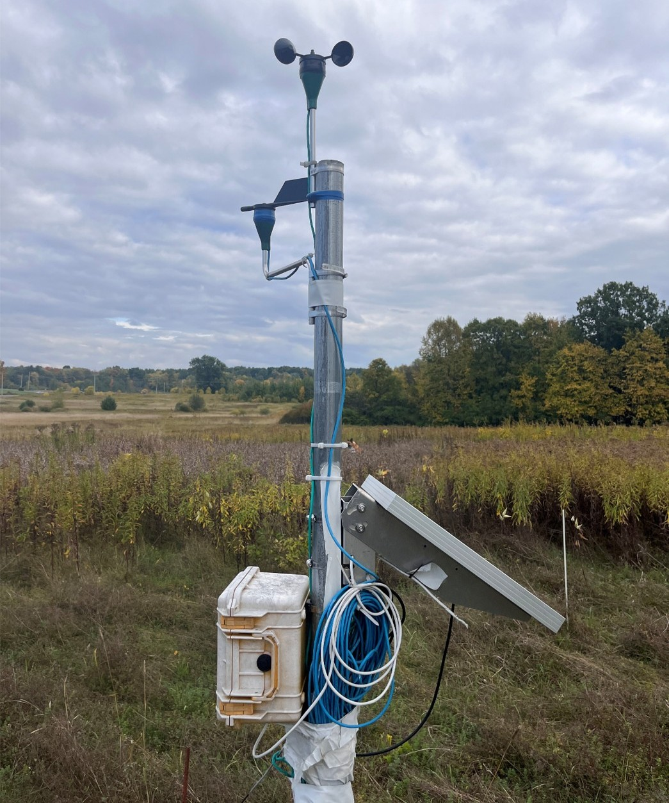

To evaluate this gradient analysis technique's performance, we used data from the St. Lawrence University Living Laboratory (SLU Living Lab). From the SLU Living Lab, we collected 65 tundra grass images taken in April 2023. The images taken were aerial images taken using a drone, see some samples in @fig-grasses. There are images ranging from a birds-eye view to close-up shots. Adding variability to the analysis, there are images with different kinds of noise such as obstructing objects on land and buildings. @fig-grasses displays the variability that may exist in each image. The red circles highlight different patches of grass within each image that could each be independently interpreted as the dominant grass lay direction. This illustrates the ambiguity that can arise when assessing dominant direction from a single image a challenge that both the gradient analysis and human assessment methods would assess differently.

::: {#fig-grasses layout-ncol=3}

{#fig-grass1 width=90%}

{#fig-grass2 width=90%}

{#fig-grass3 width=90%}

Sample SLU Living Lab Drone Grass Images. Source: Dr. Jon Rosales.

:::

The SLU Living Lab also collects various weather data. The lab has an installation of weather equipment that as seen in @fig-equipment, retrieves data from a wind vane, anemometer, and solar panel. This collects information about wind direction, speed, and other atmospheric characteristics. This data is logged every 15 minutes. @tbl-winddata is a table showing a snippet of the wind data collected. The wind data shown here covers the period from April 2022 through September 2022, which corresponds to the growing season prior to the April 2023 image collection. This alignment is linked with the grasses growing season and is discussed further in the Results section.

::: {#fig-equipment layout-ncol=2}
{#fig-equip1 width=60%}

{#fig-equip2 width=57%}

Weather Equipment at the SLU Living Lab.
:::

```{r tbl-winddata, echo=FALSE, warning=FALSE, message=FALSE}
library(knitr)
library(kableExtra)
library(readr)
library(tidyverse)
library(dplyr)

wind_data <- read_csv("output/wind_summaries/frequentwinddata.csv")
wind_display <- wind_data %>% 
  select(date, angle, speed) %>% 
  slice(117599:117609)

kbl(wind_display,
    booktabs = TRUE,
    caption = "Snippet of Wind Data Collected") %>%
  kable_styling(
    latex_options = c("striped", "hold_position"),
    full_width = FALSE
  )
```


