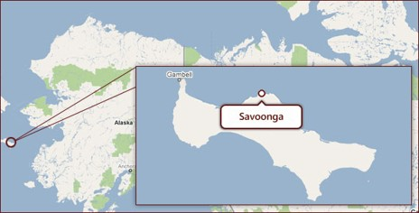
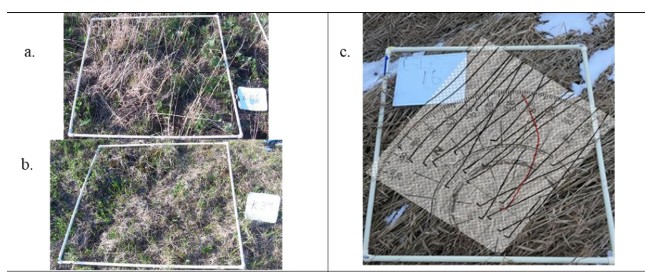

## Introduction

Savoonga, Alaska shown in @fig-map is a Yupik community located on St. Lawrence Island (SLI) in the northern Bering Sea, west of mainland Alaska and south of the Bering Strait (@kawerak2024savoonga). The region experiences harsh Arctic conditions, including strong seasonal winds, sea ice variability, and rapidly changing climate patterns that affect subsistence activities. Because daily life, settlement, travel, and hunting are closely connected to environmental conditions, local observations of wind changes are essential forms of knowledge in the region (@indigenous2013). 

{#fig-map width=80%}

Traditional Ecological Knowledge (TEK) refers to the environmental knowledge and practices developed across generations through close relationships with the land and observation of environmental changes (@definetek). In Arctic communities such as Savoonga, TEK plays an essential role in understanding local weather patterns and guiding hunting and subsistence activities. The Arctic region's extremely harsh environmental conditions make it difficult to install and reliably maintain conventional weather-monitoring equipment, such as wind sensors. As a result, long-term instrumental records of local wind patterns that could have been used to understand weather patterns or TEK recalibration are often limited or unavailable. The cultural significance of TEK also makes it essential to support its recalibration. TEK observations are qualitative and long-term, often made by persons who hunt, fish, and gather for subsistence. This makes TEK a part of a culture’s spiritual and social fabric, offering irreplaceable ecocultural knowledge that can be thousands of years old and incorporates long-standing values (@definetek).

Because of this significance of TEK in Arctic communities, a project by Dr Rosales, Dr Ramler, and Dr Torrey at St. Lawrence University proposes to investigate the TEK observation in Savoonga that prevailing wind direction has shifted from the historical northerly dominated winds 30 plus years ago to southerly and easterly dominated winds around St. Lawrence Island (SLI), on which Savoonga is located. This will serve to recalibrate the TEK of wind direction on SLI to restore the knowledge and practice of observing wind direction that is being lost with a changing Arctic (@rosales2021). 

It is for this project that tundra grasses were grown and studied at the St. Lawrence University Living Laboratory (SLU Living Lab) to serve as a controlled and accessible proxy for field conditions in Savoonga. @fig-lab shows images of the SLU Living Lab. The SLU Living Lab is a 127-acre outdoor research and teaching site located near the St. Lawrence University campus in Canton, New York. The site includes fields, forests, wetlands, and open grassland areas that support environmental monitoring and ecological research (@slulab). Although the SLU Living Lab is not an Arctic environment, it still experiences harsh winters and strong seasonal variation, meaning the grass growing cycle is constrained in ways that are somewhat comparable to tundra conditions, even if milder. Because it is difficult to repeatedly measure wind conditions in the remote and harsh environment of St. Lawrence Island, the SLU Living Lab provides a setting where wind data can be collected more systematically using wind sensors while still mimicking similar and relevant environmental constraints tundra grasses may face in the Savoonga region. This makes it possible to test and refine image-based methods against collected wind data for application to field-based TEK observations. Although the SLU Living Lab does not grow the same grass species found on St. Lawrence Island such as bluejoint reedgrass and tall cottongrass the grasses present at the lab respond to wind in similar ways, laying down after the growing season in the direction of prevailing winds. The lab therefore serves as a controlled proxy environment where the relationship between grass lay direction and wind data can be systematically tested using on-site wind sensors, before applying these methods to field images from Savoonga where wind sensor equipment is unavailable.

::: {#fig-lab layout-ncol=2}

{#fig-livinglab width=85%}

{#fig-livinglab2 width=85%}

Images of the SLU Living Lab (@slulivinglab).
:::

In the Savoonga region, residents employ the TEK practice of observing wind dynamics affecting tundra plants and in particular they examine bluejoint reedgrass (Calamagrostis canadensis) and tall cottongrass (Eriophorum angustifolium), in the sedge family, as indicators of predominant wind direction and wind direction change. Hunters and gatherers from Savoonga observe the direction these plants lay down after the growing season as proxies for predominant wind direction and wind direction change (@rosales2021). Preliminary work on this project involved a manual process for estimating grass orientation "from the SLU Living Lab field images. For instance, quadrat plots would be outlined on the ground using meter-by-meter PVC frames oriented to geographic north as shown in @fig-compass. Each quadrat was photographed, and grass lay direction was then manually determined by tracing the orientation of individual grass blades in the image.   

{#fig-compass width=80%}

To support this manually strenuous process, we investigate how we can use image gradient analysis techniques on the images of tundra grass from the St. Lawrence University Living Laboratory to automate the process of measuring grass lay directions and determining their association with collected wind data. 

```{=latex}
\clearpage
```

## Data

To evaluate this gradient analysis technique's performance, we used data from the St. Lawrence University Living Laboratory (SLU Living Lab). From the SLU Living Lab, we collected 65 tundra grass images taken in April 2023. The images taken were aerial images taken using a drone, see some samples in @fig-grasses. There are images ranging from a birds-eye view to close-up shots. Adding variability to the analysis, there are images with different kinds of noise such as obstructing objects on land and buildings. @fig-grasses displays the variability that may exist in each image. The red circles highlight different patches of grass within each image that could each be independently interpreted as the dominant grass lay direction. This illustrates the ambiguity that can arise when assessing dominant direction from a single image a challenge that both the gradient analysis and human assessment methods would assess differently.

::: {#fig-grasses layout-ncol=3}

{#fig-grass1 width=90%}

{#fig-grass2 width=90%}

{#fig-grass3 width=90%}

Sample SLU Living Lab Drone Grass Images. Source: Dr. Jon Rosales.

:::

The SLU Living Lab also collects various weather data. The lab has an installation of weather equipment that as seen in @fig-equipment, retrieves data from a wind vane, anemometer, and solar panel. This collects information about wind direction, speed, and other atmospheric characteristics. This data is logged every 15 minutes. **Table 1** is a table showing a snippet of the wind data collected. The wind data shown here covers the period from April 2022 through September 2022, which corresponds to the growing season prior to the April 2023 image collection. This alignment is linked with the grasses growing season and is discussed further in the Results section.

::: {#fig-equipment layout-ncol=2}
{#fig-equip1 width=60%}

{#fig-equip2 width=57%}

Weather Equipment at the SLU Living Lab.
:::

```{r echo=FALSE, warning=FALSE, message=FALSE}
library(knitr)
library(kableExtra)
library(readr)
library(dplyr)

wind_data <- read_csv("output/wind_summaries/frequentwinddata.csv")
wind_display <- wind_data %>% select(date, angle, speed) %>% slice(117599: 117609)

kbl(wind_display,
    booktabs = T,
    label="tbl-winddata",
    caption = "Snippet of Wind Data Collected",
    col.names = c("Date", "Angle", "Speed")) %>%
  kable_styling(latex_options = c("striped", "hold_position"),
                full_width = F) %>%
  column_spec(1, width = "4cm") %>%
  column_spec(2, width = "4cm") %>%
  column_spec(3, width = "4cm")
```


```{=latex}
\clearpage
```


## Methods

### Gradient Analysis Techniques 

In a previous senior year research project, Ben Sunshine (@sunshine2024) investigated the Histogram of Oriented Gradients (HOG) algorithm to automate the measurement of grass lay angles. They applied the algorithm to various images sampled from the internet and grass images from the SLU Living Lab to test the algorithm's viability. Upon their uncovering of its viability, this current project proceeds with adapting the algorithm's gradient analysis techniques. The HOG algorithm is a method that is used to capture the orientation of textures in an image. The first component of the HOG algorithm is to analyse gradients. An image is split into small patches called cells, and we compute the gradient magnitude and direction in each cell (@manavalan2020). These local gradients, magnitudes, and angles are extracted and then aggregated into vectors that describe the overall image to represent it into patterns that identify images and their texture. @fig-hog shows the raw grass image as the input, a grayscale image that is broken down into cells, and a snippet of vectors describing gradients in each cell of the image.

::: {#fig-hog layout="[[1,1],[-2], [1]]"}

{#fig-raw width=65%}

{#fig-posthog width=65%}

{#fig-df width=70%}

Steps of HOG Gradient Analysis.
:::

While the full HOG algorithm divides images into structured cells and further aggregates gradients into histograms, this study focuses on the core component of the method that extracts pixel-level gradient angles and magnitudes to capture dominant directions in grass images. 

The preliminary processing of the gradient analysis included loading several R packages to support image manipulation, data handling, and statistical analysis, including `tidyverse`, `imager`, `magick`, `tectonicr`, and `exif`. 

```{=latex}
\clearpage
```


```r
library(tidyverse)
library(magick)
library(imager)
library(readr)
library(exif)
library(tectonicr)
```

For each image, the processing included loading, converting the image to grayscale, and resizing it. Images were rescaled to a fixed height while preserving their aspect ratio to ensure consistent resolution across all images without introducing geometric distortion. The images were converted to grayscale to allow for focusing on representing pixel intensity in terms of texture and structural variation, rather than color information. 

```r
  img <- load.image(image) # load the image being viewed now
  img_gray <- grayscale(img) # convert to gray scale
  dims <- dim(img_gray) # retrieve dimensions of the grayed image
  h0 <- dims[1] # the height
  w0 <- dims[2] # the width
  
  # resize to target height to keep consistent size of images
  target_height <- 200 
  target_width <- max(1, round(w0 * (target_height / h0))) 
  # relative to target_height
  # recalculate width to maintain same aspect ratio
  img_resized <- resize(img_gray, size_x = target_width, 
  size_y = target_height)
```

The processed image is stored as `M`. The image's structure is defined by rows and columns of pixel values. Because the `imager` package loads images as 4-dimensional arrays by default (width, height, depth, and color channels), the image is first reduced to a 2D matrix by extracting only the first channel, since the grayscale image contains no color or depth information that would require additional dimensions. The dimensions of `M` are used to define image size, where `h` represents the number of pixel rows which is the height of the image and `w` which represents the number of pixel columns that is the width of the image.

```r
  M <- img_resized
  
  # ensures the resized grayscale image is a 2D matrix
  if (length(dim(M)) == 4) 
    M <- M[,,1,1]
  
  M <- as.matrix(M)
  
  # how many rows and cols of pixels in the images
  h <- nrow(M) 
  w <- ncol(M)
```

The gradient magnitudes and angles were then computed for every pixel in the resized image. At each pixel at row `i` and column `j`, the gradient is measured in two directions. The horizontal gradient, `Gx`, is computed by taking the difference between the pixel values immediately to the right `M[i, j+1]` and left `M[i, j-1]` of the pixel of interest. The vertical gradient, `Gy`, is computed by taking the difference between the pixel value below `M[i+1, j]` and the pixel value above `M[i-1, j]` it. At image boundaries where a neighboring pixel does not exist on one side, a one-sided difference is used instead. The overall gradient magnitude at each pixel is then derived by combining `Gx` and `Gy` using the Pythagorean formula, $\text{mag} = \sqrt{G_x^2 + G_y^2}$, which captures the strength of the intensity change at that location regardless of direction. The gradient angle is computed using the arctangent of the ratio of `Gy` to `Gx`, converted from radians to degrees.

```r
for (i in 1:h) {
  for (j in 1:w) {

    Gx <- if (j == 1) M[i, j+1] 
          else if (j == w) -M[i, j-1] 
          else M[i, j+1] - M[i, j-1]

    Gy <- if (i == 1) -M[i+1, j] 
          else if (i == h) M[i-1, j] 
          else M[i+1, j] - M[i-1, j]

    mag <- sqrt(Gx^2 + Gy^2)
  }
}
```

Grass blades are symmetric in appearance. This means that to the algorithm, a blade pointing at 10° looks the same as one pointing at 190°. Because of this, within each pixel, angles are then mapped onto a 0°–180° range. Any negative angle resulting from the arctangent calculation is shifted by adding 180° to bring it into this range.

```r
angle <- if (Gx == 0) 0 else atan(Gy / Gx) * 180 / pi
if (angle < 0) angle <- angle + 180
```

These values are then stored as vectors and structured as datasets describing each image. During computation, magnitudes and angles are stored row by row into lists, `mag_list` and `theta_list`, rather than directly into vectors. This is because appending to a list in R is more efficient than growing a vector element by element inside a nested loop, which would require R to copy and reallocate memory at each iteration. Once all pixel rows have been processed, the lists are converted to flat vectors using `unlist()` and combined into a data frame with one row per pixel containing the angle in degrees, the gradient magnitude, and the angle converted to radians. Because grass blades have defined, fine, and linear textures, these gradient extraction techniques effectively identify dominant directions and magnitudes. This supports our ability to capture a general trend or flow in the grass making gradient analysis useful for identifying a dominant grass lay direction. 

```r
# initialize lists to store the mags and theta
mag_list <- vector("list", h)
theta_list <- vector("list", h)

mag_list[[i]] <- mag_row
theta_list[[i]] <- theta_row

# Convert to vectors + save to df
mag_vec <- unlist(mag_list)
theta_vec <- unlist(theta_list)
radian_vec <- theta_vec * pi / 180

dataset_df <- data.frame(
theta = theta_vec,
mag = mag_vec,
radian = radian_vec
)
```

To observe how this gradient analysis visualizes the dominant direction of grass in an image, @fig-gradientplots shows a side-by-side comparison of a raw grass image from the St. Lawrence University Living Laboratory and its corresponding polar plot. The polar plot is generated by reading the per-pixel angle and magnitudes dataset saved for that image and plotting the theta column as a circular histogram using `ggplot2`'s coord_polar(). Each bar represents the count of pixels whose gradient angles fall within that direction, with compass directions labeled around the outside. The direction of the tallest bar represents the most frequently occurring gradient angle, giving a visual impression of the dominant grass lay direction detected by the algorithm.

```r
df <- read_csv("../output/angles_mags/DJI_0362.csv")

ggplot(df, aes(x = theta)) +
  geom_histogram(
    colour = "black", 
    fill = "darkgreen", 
    breaks = seq(0, 360, length.out = 17.5)
  ) +
  coord_polar(theta = "x", start = 0, direction = 1) +
  scale_x_continuous(
    limits = c(0, 360),
    breaks = c(0, 45, 90, 135, 180, 225, 270, 315),
    labels = c("N", "NE", "E", "SE", "S", "SW", "W", "NW")
  )
```

::: {#fig-gradientplots layout-ncol=2}

{#fig-rawgrass width=70%}

{#fig-polarplot width=95%}

Gradient Analysis Polar Plot Visualization.
:::

To summarize the pixel-level gradient angles extracted from each image, weighted circular statistics are computed using the `tectonicr` package in R. Because grass orientation is directional data that wraps around, standard linear statistics such as a regular mean or variance are not appropriate. Circular statistics are instead used, which account for the nature of angular data. The gradient magnitude at each pixel serves as a weight, meaning pixels with stronger intensity changes indicating more defined grass edges contribute more to the overall directional estimate than pixels in flat regions.

For each of the 65 images, four weighted circular statistics are computed. The circular mean is the average dominant direction of gradient angles across all pixels, weighted by magnitude, and represents the algorithm's estimate of the overall grass lay direction in the image. The circular variance measures how spread out the angles are around this mean, where a value close to 0 indicates most pixels agree on a similar direction and a value close to 1 indicates that the directions of grass in the image are more varied. The circular median is the central angle value that divides the weighted distribution in half. The circular IQR measures the spread of the middle 50% of the weighted angle distribution, capturing variability in the dominant direction without being influenced by extreme values.

```r
# Compute weighted circular statistics
  mean_val <- circular_mean(angles, w = magnitudes, axial = TRUE, na.rm = TRUE)
  var_val <- circular_var(angles, w = magnitudes, axial = TRUE, na.rm = TRUE)
  median_val <- circular_median(angles, w = magnitudes, axial = TRUE, na.rm = TRUE)
  iqr_val <- circular_IQR(angles, w = magnitudes, axial = TRUE, na.rm = TRUE)
  quantiles <- circular_quantiles(angles, w = magnitudes, axial = TRUE, na.rm = TRUE)
  
```
The `axial = TRUE` argument is used throughout because as discussed earlier, the grass orientation is axial, meaning pixel-level angles map onto a 0°–180° range rather than a full 360° scale, since a grass blade pointing at 10° is indistinguishable from one pointing at 190°. The circular statistics therefore operate on the same 0°–180° scale as the extracted angles, ensuring consistency between the pixel-level gradient computation and the image-level summary statistics. These statistics are compiled into a data frame with one row per image, containing the image name, date taken, and the four circular statistics, producing a full dataset for further analysis. **Table 2** shows a sample of this dataset.

```{r echo=FALSE, warning=FALSE, message=FALSE}
grad_stats <- read_csv("output/weighted_datasets/weighted_dataset_rot0.csv")

grad_display <- grad_stats %>% 
  select(image_name, circular_mean, circular_variance, circular_median, circular_IQR) %>%
  head(8)

kbl(grad_display,
    booktabs = T,
    label="tbl-gradientstats",
    caption = "Sample of Weighted Circular Statistics for Gradient Analysis",
    col.names = c("Image", "Circ. Mean", "Circ. Variance", "Circ. Median", "Circ. IQR")) %>%
  kable_styling(latex_options = c("striped", "hold_position"),
                full_width = F) %>%
  column_spec(1, width = "3.5cm") %>%
  column_spec(2, width = "2cm") %>%
  column_spec(3, width = "2.5cm") %>%
  column_spec(4, width = "2.5cm") %>%
  column_spec(5, width = "2cm")
```

To validate the gradient analysis results, human assessments of the same 65 SLU Living Lab images were collected using a custom R Shiny web application, described in the following section.

### Human Assessment of Grass Lay Using R Shiny Web App

As discussed in the Introduction, the Traditional Ecological Knowledge (TEK) of physically observing grass lay is a method used by Arctic community members. Hunters and gatherers will observe the direction plants lay down after the growing season as proxies for predominant wind direction and wind direction change. To replicate this observational process, we customized an app to retrieve volunteers' perceptions of direction that grass lays. Shiny is an R package that makes it easy to build interactive web applications straight from R (@defineshiny). We used Shiny to customize an interactive grass app to collect human assessments of the grass images' dominant grass lay direction. 45 volunteers completed the assessment of all 65 grass images. Each participant session is assigned a unique `UUID` to ensure anonymity while preserving response traceability. The application presents users with the series of grass images and prompts them to indicate the dominant direction of grass lay by clicking directly on the image. Upon clicking, a visual arrow is displayed to reflect the selected direction, allowing users to adjust their response before submission. See @fig-grassapp. 

](media/grassapp.png){#fig-grassapp width=100%}

The 65 grass images are stored in a GitHub repository and retrieved at the start of each session using the GitHub API. The API call constructs a URL pointing to the images folder of the repository and uses `jsonlite::fromJSON()` to parse the response, extracting all filenames with image extensions into a master list called `img_master_global`. This approach avoids hardcoding file paths and ensures the full image set is always current without needing to update the app code when images change.

```r
# Github variables
repo_owner <- "franriee"
repo_name <- "SYE_Grass_Study"

# Use regular images folder to get the master list of filenames
folder_api <- paste0("https://api.github.com/repos/", 
repo_owner, "/", repo_name, "/contents/images")
files <- jsonlite::fromJSON(folder_api)

# Create a data frame to keep the image names 
img_master_global <- data.frame(
  name = files$name[grepl("\\.(png|jpg|jpeg)$", files$name, 
  ignore.case = TRUE)], 
  stringsAsFactors = FALSE
)
```

When a new participant session begins, the Shiny server creates a session-specific shuffled copy of `img_master_global` by randomly reordering the rows using `sample()`. This means every participant sees the same 65 images but in a different order, reducing ordering effects where earlier images might systematically influence responses to later ones. To further reduce bias, a random rotation is pre-assigned to every image for that session by sampling from 0°, 90°, 180°, and 270°. This is important because the region the St. Lawrence University Living Laboratory is located experiences predominant northeasterly winds, and volunteers familiar with the site may already know this. Without rotation, a participant who recognizes the field's geographic orientation could use that prior knowledge to guess that grass lays in the direction of the prevailing northeast wind rather than genuinely assessing the direction they perceive from the image itself. By randomly rotating each image before display, no fixed compass orientation is preserved, ensuring that responses reflect the participant's actual visual perception of grass lay direction rather than recalled knowledge of local wind patterns.

```r
server <- function(input, output, session) {
  img_master <- img_master_global[sample(nrow(img_master_global)), 
  , drop = FALSE]
  
  session_rotations <- sample(c(0, 90, 180, 270), 
  nrow(img_master), replace = TRUE)

```
Each image is displayed using a Plotly-based interface. `Plotly` is an interactive graphing library in R that supports event-driven interactions such as mouse clicks, making it well suited for collecting user input directly on top of an image (@defineplotly). The image is overlaid onto a coordinate grid ranging from 0 to 1 in both the x and y dimensions, rendered as a background layer beneath an invisible heatmap. This design allows click positions to be precisely recorded without needing to re-render the grass image each time the participant adjusts their arrow.

```r
plot_ly(
      x = g, y = g, z = z,
      type = "heatmap",
      showscale = FALSE,
      hoverinfo = "none",
      source = "grass_plot",
      colorscale = list(list(0, "rgba(0,0,0,0)"), 
      list(1, "rgba(0,0,0,0)"))
    ) %>%
      layout(
        xaxis = list(range = c(0, 1), visible = FALSE, 
        fixedrange = TRUE),
        yaxis = list(range = c(0, 1), visible = FALSE, 
        fixedrange = TRUE, scaleanchor = "x"),
        images = list(list(
          source = github_raw_url,
          x = 0, y = 1, sizex = 1, sizey = 1,
          xref = "x", yref = "y", sizing = "contain", 
          layer = "below"
        )),
        margin = list(l=0, r=0, t=0, b=0),
        annotations = list() # Clear old arrows on re-render
      ) %>%
      config(displayModeBar = FALSE)
  })

```

When a participant clicks on the image, Plotly captures the click coordinates `d$x` and `d$y`. The angular direction of the click is then computed relative to the center of the image at `(0.5, 0.5)`. The horizontal and vertical distances from the center, `dx` and `dy`, are passed to `atan2()` which computes the angle in radians and converts it to degrees. The result is mapped onto a 0°–360° circular scale using the modulo operator `%% 360`. A visual arrow is then rendered from the image center to the click position using `plotlyProxyInvoke()`, which updates only the annotation layer of the plot without re-rendering the background image, allowing the participant to adjust their response smoothly before submitting.

```r
  # Listen for plotly click
  observeEvent(event_data("plotly_click", source = "grass_plot"), 
  { 
    d <- event_data("plotly_click", source = "grass_plot")
    req(d) # require that the click is not null
    
    # Update the last saved clicks
    last_click_x(d$x)
    last_click_y(d$y)
    
    # Angle calculation from center (0.5, 0.5)
    dx <- d$x - 0.5
    dy <- d$y - 0.5
    
    # Convert x,y to degrees (using atan2)
    res_angle <- (atan2(dx, dy) * 180 / pi) %% 360
    current_angle(res_angle)
    
    # Update arrow
    # plotlyProxy to modify only the annotation layer of the plot
    # relayout updates the arrow position instantly without 
    # re-rendering the background grass image
    plotlyProxy("img_display", session) %>%
      plotlyProxyInvoke("relayout", list(
        annotations = list(list(
          x = d$x, y = d$y,
          ax = 0.5, ay = 0.5,
          xref = "x", yref = "y",
          axref = "x", ayref = "y",
          text = "", 
          showarrow = TRUE,
          arrowwidth = 5,
          arrowhead = 3,
          arrowcolor = "#4B0082"
        ))
      ))
  })
}
```

In addition to the angular direction, the Euclidean distance from the image center to the click position is recorded as a magnitude value, computed from `dx` and `dy` using the Pythagorean formula. This distance serves as a proxy for response confidence where a click far from the center suggests a more deliberate directional choice, while a click at or very close to the center may indicate uncertainty in their choice of dominant grass lay. Because the arrow defaults to the center position `(0.5, 0.5)` before any click is made, a magnitude of 0 means the participant submitted without clicking, leaving the angle unchanged from its default value. We assume that these submissions do not represent a genuine assessment of grass direction and would introduce noise into the circular statistics. To address this, responses with a magnitude of exactly 0 were filtered out before computing the per-image circular statistics, retaining only submissions where the participant made a deliberate click away from the center.

```{=latex}
\clearpage
```


```r
 # Get the click
    cx <- last_click_x()
    cy <- last_click_y()
    dx <- cx - 0.5
    dy <- cy - 0.5
    mag <- sqrt(dx^2 + dy^2)
```

All responses are stored in real time using the Google Sheets API via the `googlesheets4` package, enabling immediate cloud-based logging into a Google Sheet without local storage dependencies. After each submission, a row is appended to the connected Google Sheet containing the participant's unique session ID, the image name, the displayed rotation, the raw submitted angle, the true angle corrected for rotation by reversing the applied rotation `(current_angle() - rotation() %% 360)`, the click coordinates, the magnitude, and a timestamp. This structure ensures full reproducibility and traceability of all responses.

```r
# Google sheets connection
gs4_auth(path = "xxxxxxx.json")
sheet_url <- "https://xxxxxxxxxxx"
codes_sheet_url <- "https://xxxxxxxx"

# Add to Google Sheet
    # Upon submission, create the row of data by creating a df
    # Retrieve the name of the image the user is seeing
    # Add the new data to the Google Sheet (sheet)
    sheet_append(sheet_url, data.frame(
      UserID = user_session_id,
      Image = img_master$name[idx()], 
      User_Angle = round(current_angle(), 2),
      True_Angle = round((current_angle() - rotation()) %% 360, 
      2), # reverse the rotation and that is the true angle
      Rotation = rotation(),
      Timestamp = format(Sys.time(), tz = "America/New_York"),
      Coord_x = round(cx, 4),
      Coord_y = round(cy, 4),
      Magnitude = round(mag, 2)
    ), sheet = "Results")
```

Just as with the gradient analysis, the submitted human responses are summarized using circular statistics computed per image across all 45 participants. Before computing the statistics, responses with a magnitude of 0 are filtered out as described earlier, retaining only deliberate submissions. The `True_Angle` column which represents each participant's submitted angle corrected for the random rotation applied to that image is used as the input, ensuring that all responses are on the same scale regardless of which rotation the participant saw. For each of the 65 images, the circular mean, circular variance, circular median, and circular IQR are computed across all valid participant responses again using `axial = TRUE` in order to ensure that both the gradient analysis and human assessment circular statistics are summarized on the same axial scale. This produces a data frame of one row per image containing the human assessment circular statistics as seen in **Table 3**.


```{=latex}
\clearpage
```


```r
# Create a df that summarises the circular stats 
humangrassanalysis_df <-
  grass_csv %>%
  filter(Magnitude != 0) %>% # filter 
  group_by(Image) %>% # to get the average results across everyone who did it
  summarise(circular_mean = circular_mean(True_Angle, axial = TRUE, na.rm = TRUE),
            circular_var = circular_var(True_Angle, axial = TRUE, na.rm = TRUE),
            circular_median = circular_median(True_Angle, axial = TRUE, na.rm = TRUE),
            circular_IQR = circular_IQR(True_Angle, axial = TRUE, na.rm = TRUE))
  
```
```{r echo=FALSE, warning=FALSE, message=FALSE}
hum_stats <- read_csv("output/wind_summaries/humangrassanalysis.csv")

hum_display <- hum_stats %>% 
  select(Image, circular_mean, circular_var, circular_median, circular_IQR) %>%
  head(8)

kbl(hum_display,
    booktabs = T,
    label="tbl-humanstats",
    caption = "Sample of Circular Statistics for Human Assessment",
    col.names = c("Image", "Circ. Mean", "Circ. Variance", "Circ. Median", "Circ. IQR")) %>%
  kable_styling(latex_options = c("striped", "hold_position"),
                full_width = F) %>%
  column_spec(1, width = "3.5cm") %>%
  column_spec(2, width = "2cm") %>%
  column_spec(3, width = "2.5cm") %>%
  column_spec(4, width = "2.5cm") %>%
  column_spec(5, width = "2cm")
```

The findings from both the gradient analysis techniques and the human assessment of images were compared to evaluate the validity of results obtained from the gradient analysis techniques. The next section will highlight the results as well as assess this data's association with wind data during the growing season the previous year. 


```{=latex}
\clearpage
```

## Results

### Compare Results Between Gradient Analysis and Human Assessment

To evaluate the differences between the results from the Gradient Analysis and Human Assessment, we computed the circular distances between the two methods' circular means, which represent the dominant direction of grass estimated from each image using both techniques. The unit for the circular statistics are degrees. Circular distance is used rather than a simple numerical difference because grass orientation is axial data, meaning the difference between two angles must account for the circular nature of the data. The `circular_distance()` function from the `tectonicr` package computes this, returning values on a scale of 0 to 1, where 0 means the two methods agree perfectly on the same direction and 1 means they are as far apart as possible which corresponds to the maximum possible angular disagreement on the axial scale.

```r
# Calculate distances between human vs hog
diff_df <- data.frame(
  image = hog_df$image_name,
  human_angle = human_df$circular_mean,
  hog_angle = hog_df$circular_mean,
  circular_distance = circular_distance(human_df$circular_mean,
  hog_df$circular_mean, axial = TRUE, na.rm = TRUE))

diff_df

write_csv(diff_df, file.path(output_dir, "diff_df.csv"))
```

To help calibrate what these values mean in practice: a circular distance of 0 indicates perfect agreement, 0.25 corresponds to a moderate directional difference of roughly 22.5°, 0.5 corresponds to a 45° difference, and 1.0 is the maximum possible.

The mean circular distance across all 65 images is 0.26 with a variance of 0.09, suggesting that on average the gradient analysis and human assessment are in moderate agreement. The minimum circular distance of 0.0006 indicates near-perfect agreement for at least one image, while the maximum of 0.999 indicates that for at least one image the two methods produced nearly perpendicular dominant direction estimates. There are a number of images where both methods closely align, but also a number where they diverge substantially. In @fig-results, the yellow arrow represents the dominant direction estimated by the gradient analysis and the black arrow represents the human assessment, illustrating examples of both low, medium, and high circular distance cases.

::: {#fig-results layout-ncol=3}

{#fig-resultmin width=80%}

{#fig-resultmax width=80%}

{#fig-resultblurry width=80%}

Images Showing Circular Distance.

:::

There are a number of reasons we assume the retrieved dominant angle differs significantly between the gradient analysis and the human assessment. 

The first is that while the gradient analysis uses magnitude weighting in the circular statistics to give more influence to pixels with stronger intensity changes, this weighting is applied across all pixels in the image without first filtering out regions where no meaningful grass structure exists. Pixels in flat, texturally uniform regions such as bare soil, shadows, or background objects still produce gradient responses, and even with low magnitudes they collectively contribute to the overall dominant grass direction estimate. When many such low-magnitude pixels are spread across non-grass regions of the image, their cumulative effect can still shift the weighted circular mean away from the true grass lay direction. A human observer instinctively ignores these regions entirely, focusing attention only on areas where grass texture is clearly visible. The algorithm, by contrast, incorporates every pixel's contribution unless a magnitude threshold is explicitly applied beforehand to exclude low-confidence regions, making it more susceptible to being pulled by noise from non-grass areas of the image.

A second source of disagreement is the variety of aerial perspectives across the 65 images. Some images were captured from directly overhead, providing a clear top-down view of grass lay patterns, while others were taken at a lower angle closer to the grass surface, changing how gradient directions are expressed in the image. Image quality like in @fig-resultblurry produced blurry outlines and reduced texture clarity. In such cases the gradient analysis struggles to identify a coherent dominant direction, while human observers may still be able to use contextual cues to make a reasonable directional judgment.

### Comparing Dominant Grass Direction and Wind Data

At the SLU Living Lab, a wind station installed adjacent to the tundra vegetation records wind speed and direction at 15-minute intervals via a wind vane and anemometer as seen in @fig-equipment. To align the wind data with the grass images, the 15-minute readings were aggregated to daily circular mean wind directions using circular statistics, accounting for the angular nature of wind direction data. This produces one representative wind direction per day that captures the overall prevailing direction across all readings that day.

To connect the grass images to the wind data, EXIF metadata that is the Exchangeable Image File Format information embedded in every digital image file was extracted from each drone image using the `exif` package in R (@cci2024). The `DateTimeOriginal` field was retrieved, which records the exact date the image was captured by the drone, and cleaned into a standardized date variable. Since the grass images were taken in April 2023, wind data from April through September 2022 (the full growing season prior to image capture) was used for comparison. The rationale is that grass lay direction observed in April 2023 reflects the cumulative effect of winds experienced during the 2022 growing season when the grass was actively growing and being shaped by prevailing conditions.

Nine representative images with the smallest circular distances between gradient analysis and human assessment were selected, representing cases of strongest agreement between the two methods on dominant grass direction. The gradient analysis dominant direction for each of these nine images was overlaid as a colored vertical line on polar histograms of the monthly wind direction distributions from April through September 2022. 
             
In @fig-monthplots, the grass lay directions from the nine selected images are represented as colored vertical lines overlaid on each month's wind direction polar histogram. The alignment between the lines and the dominant bars of the wind histogram indicates months where grass lay direction corresponds well with prevailing wind patterns. This alignment is most evident in the spring months of April and May, which represent the early growing season when grass is most actively responding to wind exposure. This correspondence supports the use of grass lay direction as a proxy for prevailing wind direction, particularly during the growing season.

{#fig-monthplots width=120%}

```{=latex}
\clearpage
```

## Conclusion

Overall, we find that in several images there is strong agreement between human assessments and gradient-based estimates of dominant grass direction, validating the gradient analysis as a reasonable method for estimating grass lay direction automatically. In these cases, both methods produce similar results, suggesting that they can successfully capture the main direction of grass lay from images. When compared with wind data, this alignment is strongest in the spring season, which is the main growing period for tundra grass. During this time, the grass is more flexible and responsive to environmental conditions, making patterns of alignment easier to detect.

However, there are still important cases where human assessments and gradient-based methods do not agree, suggesting that both approaches may have limitations. Human assessments can be affected by how clear or complex the image is, while gradient methods can be influenced by image noise, texture, or lighting conditions, and thus need algorithmic fine tuning. Because of this, further work is needed to understand when each method performs well and when it fails.

### Recommendations

Based on the findings of this project, we offer the following recommendations for future data collection, algorithmic improvement, and community application.

**Image Collection Standards**

The results show that images taken at very high altitudes where individual grass blade texture is difficult to resolve, or images with blurry outlines, consistently produced the highest circular distances between gradient analysis and human assessment, indicating that image quality is a significant driver of disagreement. We recommend that future drone image collection for this purpose follow standardized protocols where images should be taken directly overhead at a consistent altitude to minimize perspective distortion, during daylight hours with minimal shadow cover, and at a resolution sufficient to clearly resolve individual grass blade texture. Standardizing these factors would reduce variability in both human and computational assessments and improve the reliability of comparisons across sites and seasons.

**Algorithmic Improvements**

The gradient analysis currently computes circular statistics across all pixels in an image, including low-magnitude regions corresponding to bare soil, shadows, and background objects that carry no meaningful grass orientation signal. Even with magnitude weighting, the cumulative contribution of these regions can shift the dominant direction estimate. We recommend applying an explicit magnitude threshold filter before computing circular statistics to retain only pixels with gradient magnitudes above a meaningful level. Fine-tuning an optimal threshold that is potentially image-specific and based on the magnitude distribution would be a valuable next step toward improving the algorithm's accuracy.

**Human vs. Automated Assessment**

There is also potential for practical application beyond research. A simple web-based tool could allow community members or local observers to upload field images and estimate local wind direction automatically. The choice between human crowd-sourcing and automated gradient analysis likely depends on the goal and context of use. In communities like Savoonga where TEK already involves the practice of physically observing grass lay, expanding human participation through crowd-sourcing may be the more natural and culturally appropriate approach where more observers following the same traditional practice would help standardize, recalibrate, and strengthen the existing knowledge system rather than replacing it. In contrast, for research contexts where eliminating human perceptual bias and subjectivity is important, or where large volumes of images need to be processed consistently across sites, the gradient analysis offers a more scalable and repeatable alternative. The best approach therefore depends not just on image quality or algorithmic performance, but on whether the goal is to support and scale an existing human observational practice or to provide an objective computational tool independent of human judgment.

### Future Work

These results have shown promising agreement between human perception, computational methods, and wind data in certain conditions. At the same time, they highlight the importance of improving data collection practices, understanding sources of disagreement, and expanding fine-tuning goals. Future analysis should focus on disagreement cases in more detail to identify when vegetation direction is not a reliable indicator of wind, or when one method is more accurate than the other. It would also be useful to compare results across different years, such as using 2023 wind data and 2024 grass images, to test whether these patterns remain consistent over time and under different environmental conditions. This project could also be expanded beyond tundra grass to other vegetation types that respond to wind in different seasons. Together, these steps move toward a more robust framework for linking image-based vegetation analysis with environmental wind patterns in support of both scientific understanding and Traditional Ecological Knowledge.

```{=latex}
\clearpage
```

## References


