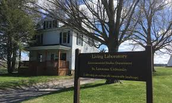
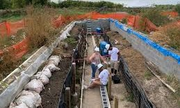

Savoonga, Alaska shown in @fig-map is a Yupik community located on St. Lawrence Island (SLI) in the northern Bering Sea, west of mainland Alaska and south of the Bering Strait [@kawerak2024savoonga]. The region experiences harsh Arctic conditions, including strong seasonal winds, sea ice variability, and rapidly changing climate patterns that affect subsistence activities. Because daily life, settlement, travel, and hunting are closely connected to environmental conditions, local observations of wind changes are essential forms of knowledge in the region [@indigenous2013]. 

![Location of Savoonga, Alaska on St. Lawrence Island in the Bering Sea [@rosales2021].](map.jpg){#fig-map width=80%}

Traditional Ecological Knowledge (TEK) refers to the environmental knowledge and practices developed across generations through close relationships with the land and observation of environmental changes [@definetek]. In Arctic communities such as Savoonga, TEK plays an essential role in understanding local weather patterns and guiding hunting and subsistence activities. The Arctic region's extremely harsh environmental conditions make it difficult to install and reliably maintain conventional weather-monitoring equipment, such as wind sensors. As a result, long-term instrumental records of local wind patterns that could have been used to understand weather patterns or TEK recalibration are often limited or unavailable. The cultural significance of TEK also makes it essential to support its recalibration. TEK observations are qualitative and long-term, often made by persons who hunt, fish, and gather for subsistence. This makes TEK a part of a culture’s spiritual and social fabric, offering irreplaceable ecocultural knowledge that can be thousands of years old and incorporates long-standing values [@definetek].

Because of this significance of TEK in Arctic communities, a project by Dr Rosales, Dr Ramler, and Dr Torrey at St. Lawrence University proposes to investigate the TEK observation in Savoonga that prevailing wind direction has shifted from the historical northerly dominated winds 30 plus years ago to southerly and easterly dominated winds around St. Lawrence Island (SLI), on which Savoonga is located. This will serve to recalibrate the TEK of wind direction on SLI to restore the knowledge and practice of observing wind direction that is being lost with a changing Arctic [@rosales2021]. 

It is for this project that tundra grasses were grown and studied at the St. Lawrence University Living Laboratory (SLU Living Lab) to serve as a controlled and accessible proxy for field conditions in Savoonga. @fig-lab shows images of the SLU Living Lab. The SLU Living Lab is a 127-acre outdoor research and teaching site located near the St. Lawrence University campus in Canton, New York. The site includes fields, forests, wetlands, and open grassland areas that support environmental monitoring and ecological research [@slulab]. Although the SLU Living Lab is not an Arctic environment, it still experiences harsh winters and strong seasonal variation, meaning the grass growing cycle is constrained in ways that are somewhat comparable to tundra conditions, even if milder. Because it is difficult to repeatedly measure wind conditions in the remote and harsh environment of St. Lawrence Island, the SLU Living Lab provides a setting where wind data can be collected more systematically using wind sensors while still mimicking similar and relevant environmental constraints tundra grasses may face in the Savoonga region. This makes it possible to test and refine image-based methods against collected wind data for application to field-based TEK observations. Although the SLU Living Lab does not grow the same grass species found on St. Lawrence Island such as bluejoint reedgrass and tall cottongrass the grasses present at the lab respond to wind in similar ways, laying down after the growing season in the direction of prevailing winds. The lab therefore serves as a controlled proxy environment where the relationship between grass lay direction and wind data can be systematically tested using on-site wind sensors, before applying these methods to field images from Savoonga where wind sensor equipment is unavailable.

::: {#fig-lab layout-ncol=2}

{#fig-livinglab width=85%}

{#fig-livinglab2 width=85%}

Images of the SLU Living Lab [@slulivinglab].
:::

In the Savoonga region, residents employ the TEK practice of observing wind dynamics affecting tundra plants and in particular they examine bluejoint reedgrass (Calamagrostis canadensis) and tall cottongrass (Eriophorum angustifolium), in the sedge family, as indicators of predominant wind direction and wind direction change. Hunters and gatherers from Savoonga observe the direction these plants lay down after the growing season as proxies for predominant wind direction and wind direction change [@rosales2021]. Preliminary work on this project involved a manual process for estimating grass orientation from the SLU Living Lab field images. For instance, quadrat plots would be outlined on the ground using meter-by-meter PVC frames oriented to geographic north as shown in @fig-compass. Each quadrat was photographed, and grass lay direction was then manually determined by tracing the orientation of individual grass blades in the image.   

![Manual process Of estimating grass orientation in grass images [@rosales2021].](compass.jpg){#fig-compass width=80%}

To support this manually strenuous process, we investigate how we can use image gradient analysis techniques on the images of tundra grass from the St. Lawrence University Living Laboratory to automate the process of measuring grass lay directions and determining their association with collected wind data. 

