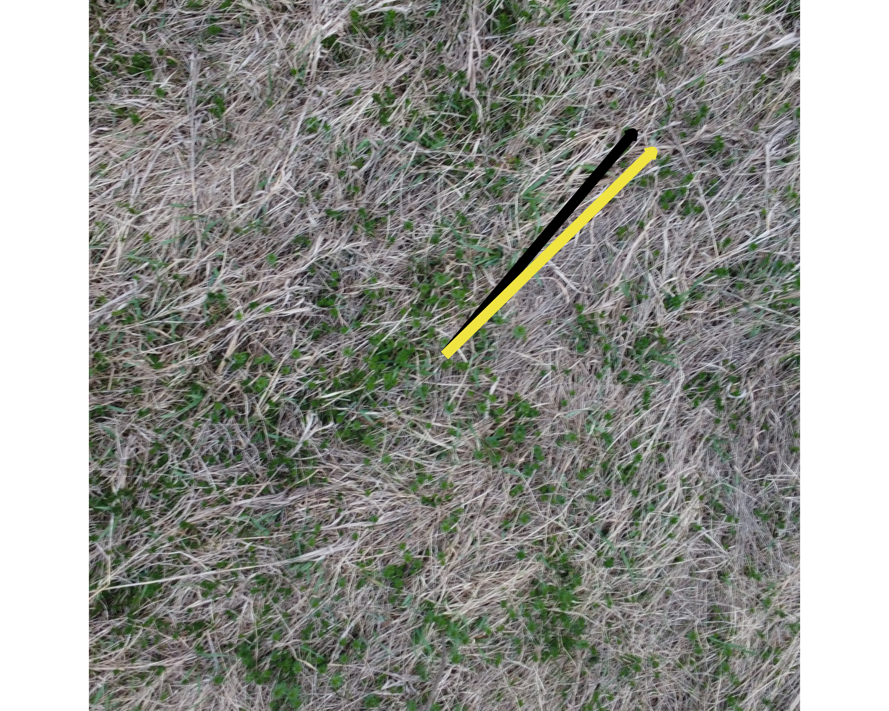
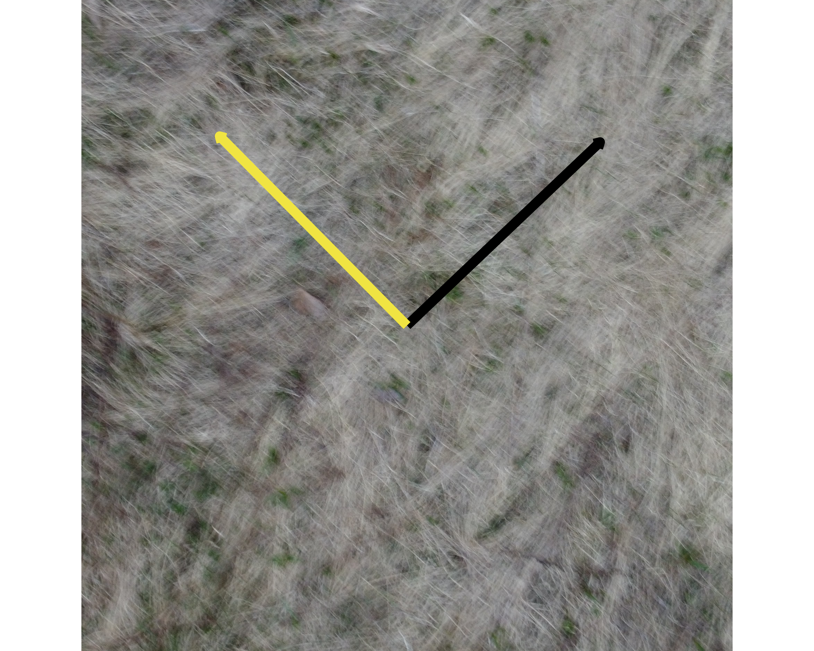
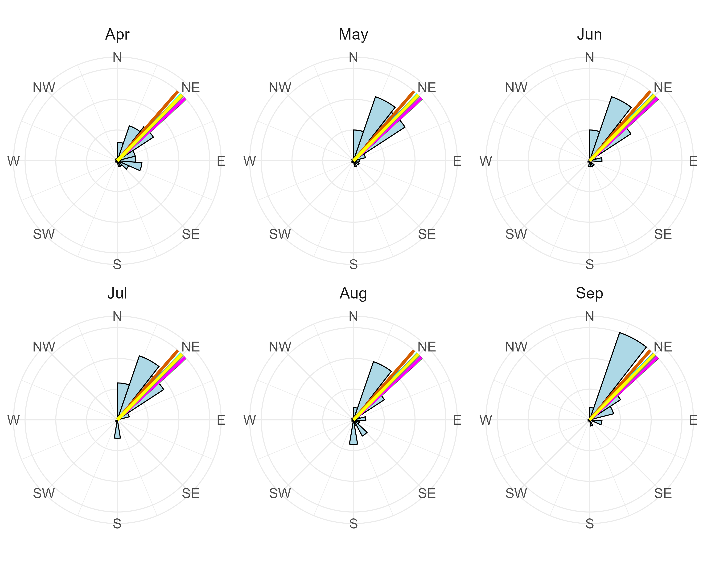

### Compare Results Between Gradient Analysis and Human Assessment

To evaluate the differences between the results from the Gradient Analysis and Human Assessment, we computed the circular distances between the two methods' circular means, which represent the dominant direction of grass estimated from each image using both techniques. The unit for the circular statistics are degrees. Circular distance is used rather than a simple numerical difference because grass orientation is axial data, meaning the difference between two angles must account for the circular nature of the data. The `circular_distance()` function from the `tectonicr` package computes this, returning values on a scale of 0 to 1, where 0 means the two methods agree perfectly on the same direction and 1 means they are as far apart as possible which corresponds to the maximum possible angular disagreement on the axial scale.

```r
# Calculate distances between human vs hog
diff_df <- data.frame(
  image = hog_df$image_name,
  human_angle = human_df$circular_mean,
  hog_angle = hog_df$circular_mean,
  circular_distance = circular_distance(human_df$circular_mean,
  hog_df$circular_mean, axial = TRUE, na.rm = TRUE))

diff_df

write_csv(diff_df, file.path(output_dir, "diff_df.csv"))
```

To help calibrate what these values mean in practice: a circular distance of 0 indicates perfect agreement, 0.25 corresponds to a moderate directional difference of roughly 22.5°, 0.5 corresponds to a 45° difference, and 1.0 is the maximum possible.

The mean circular distance across all 65 images is 0.26 with a variance of 0.09, suggesting that on average the gradient analysis and human assessment are in moderate agreement. The minimum circular distance of 0.0006 indicates near-perfect agreement for at least one image, while the maximum of 0.999 indicates that for at least one image the two methods produced nearly perpendicular dominant direction estimates. There are a number of images where both methods closely align, but also a number where they diverge substantially. In @fig-results, the yellow arrow represents the dominant direction estimated by the gradient analysis and the black arrow represents the human assessment, illustrating examples of both low, medium, and high circular distance cases.


::: {#fig-results layout-ncol=3}

{#fig-resultmin width=200%}

{#fig-resultmax width=200%}

{#fig-resultblurry width=200%}

Images Showing Circular Distance.

:::

There are a number of reasons we assume the retrieved dominant angle differs significantly between the gradient analysis and the human assessment. 

The first is that while the gradient analysis uses magnitude weighting in the circular statistics to give more influence to pixels with stronger intensity changes, this weighting is applied across all pixels in the image without first filtering out regions where no meaningful grass structure exists. Pixels in flat, texturally uniform regions such as bare soil, shadows, or background objects still produce gradient responses, and even with low magnitudes they collectively contribute to the overall dominant grass direction estimate. When many such low-magnitude pixels are spread across non-grass regions of the image, their cumulative effect can still shift the weighted circular mean away from the true grass lay direction. A human observer instinctively ignores these regions entirely, focusing attention only on areas where grass texture is clearly visible. The algorithm, by contrast, incorporates every pixel's contribution unless a magnitude threshold is explicitly applied beforehand to exclude low-confidence regions, making it more susceptible to being pulled by noise from non-grass areas of the image.

A second source of disagreement is the variety of aerial perspectives across the 65 images. Some images were captured from directly overhead, providing a clear top-down view of grass lay patterns, while others were taken at a lower angle closer to the grass surface, changing how gradient directions are expressed in the image. Image quality like in @fig-resultblurry produced blurry outlines and reduced texture clarity. In such cases the gradient analysis struggles to identify a coherent dominant direction, while human observers may still be able to use contextual cues to make a reasonable directional judgment.

### Comparing Dominant Grass Direction and Wind Data

At the SLU Living Lab, a wind station installed adjacent to the tundra vegetation records wind speed and direction at 15-minute intervals via a wind vane and anemometer. To align the wind data with the grass images, the 15-minute readings were aggregated to daily circular mean wind directions using circular statistics, accounting for the angular nature of wind direction data. This produces one representative wind direction per day that captures the overall prevailing direction across all readings that day.

To connect the grass images to the wind data, EXIF metadata that is the Exchangeable Image File Format information embedded in every digital image file was extracted from each drone image using the `exif` package in R [@cci2024]. The `DateTimeOriginal` field was retrieved, which records the exact date the image was captured by the drone, and cleaned into a standardized date variable. Since the grass images were taken in April 2023, wind data from April through September 2022 (the full growing season prior to image capture) was used for comparison. The rationale is that grass lay direction observed in April 2023 reflects the cumulative effect of winds experienced during the 2022 growing season when the grass was actively growing and being shaped by prevailing conditions.

Nine representative images with the smallest circular distances between gradient analysis and human assessment were selected, representing cases of strongest agreement between the two methods on dominant grass direction. The gradient analysis dominant direction for each of these nine images was overlaid as a colored vertical line on polar histograms of the monthly wind direction distributions from April through September 2022. 
             
In @fig-monthplots, the grass lay directions from the nine selected images are represented as colored vertical lines overlaid on each month's wind direction polar histogram. The alignment between the lines and the dominant bars of the wind histogram indicates months where grass lay direction corresponds well with prevailing wind patterns. This alignment is most evident in the spring months of April and May, which represent the early growing season when grass is most actively responding to wind exposure. This correspondence supports the use of grass lay direction as a proxy for prevailing wind direction, particularly during the growing season.

{#fig-monthplots width=80%}
