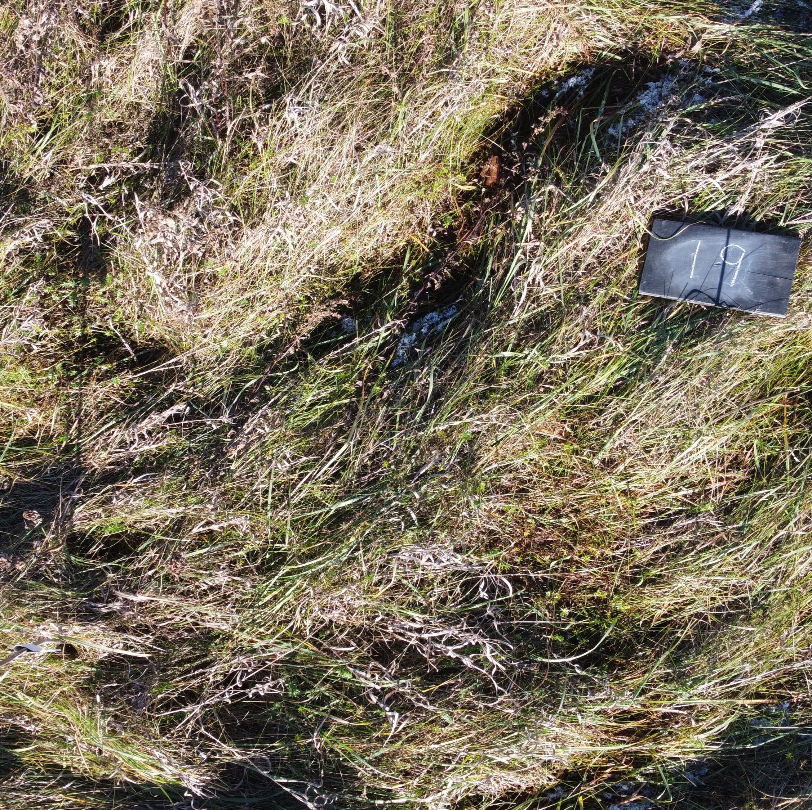

## Abstract

We explore the use gradient analysis adapted from some components of the Histogram of Oriented Gradients (HOG) to estimate grass orientation from images taken from the St. Lawrence Living Lab. The results of this algorithm are going to be compared to human-generated input  to validate the algorithm's accuracy compared to human observations to ensure the tool is accurate enough to support community-led climate monitoring. This comparison allows us to evaluate the gradient analysis' ability to recover grass orientation from raw grass images compared to what a human would naturally choose as predominate grass orientation in an image. The goal is automate the estimation of grass orientation from images to understand wind patterns. These results provide a first step toward potential applications that could help communities monitor changes in local wind patterns from grass images in fields amidst climate-driven environmental changes.

## 1. Introduction

Understanding vegetation orientation matters for many agricultural activities. In Arctic communities, residents have long relied on Traditional Ecological Knowledge (TEK), in particular, physically observing how grass lays, to guide hunting and subsistence activities. However, changes in climate and a lack of historical wind data in harsh weather conditions have made these patterns harder to predict and keep track of. By using image analysis, we hope to support and recalibrate this TEK so the community can track shifts in wind direction that affect weather, sea ice, and subsistence activities. Our goal is to develop reliable and efficient data science methods for measuring grass orientation from field images to better understand changing wind patterns in Savoonga, Alaska. 

## 2. Background

We explore the use of Histogram of Oriented Gradients (HOG) to automate the estimation of grass orientation from images to understand wind patterns. The results of this algorithm are going to be compared to human-generated input  to validate the algorithm's accuracy compared to human observations to ensure the tool is accurate enough to support community-led climate monitoring.

## 3. Data

Brief overview of Histogram of Oriented Gradients (HOG).

Other orientation-detection approaches: Fourier transform, Gabor filters, Sobel operators, et

To evaluate this Machine Learning algorithm's performance, we used Tundra grass images from the St. Lawrence University Living Lab taken in March and April 2023 by Dr. Jon Rosales (St. Lawrence University, Environmental Studies). The images taken were aerial images taken with a drone. There are a varied range of images from a birds-eye view to close-up shorts. Aiding variability in the analysis, there are images with different kinds of noise such as obstructing objects on land, weather detection devices, barns, and more. Some images had grass obviously leaning in one direction while others had an ambiguous dominant grass lay direction.

 

Sample Living Lab Images

## 4. Methods

Describe the workflow: preprocessing, applying HOG (or alternatives), extracting orientation distributions.

Explain how results are summarized (histograms, density curves, summary statistics).

## 5. Discussion

Strengths/weaknesses of HOG vs other approaches.

Implications for environmental monitoring and agricultural practice.

Limitations (e.g., noisy data, heterogeneous vegetation, computational cost).

Future work (scaling up, automating, extending to other vegetation types, drone applications).

## 6. Conclusion

Restate main contributions: demonstration of HOG/alternatives for grass orientation; robustness under multiple conditions; link to environmental applications

