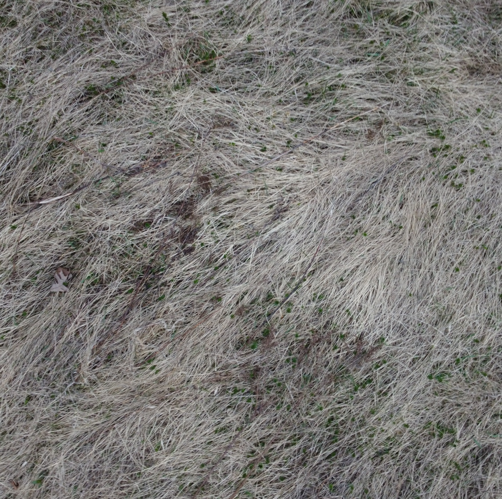
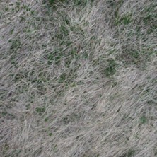
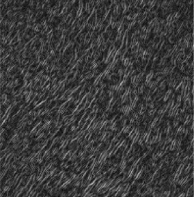
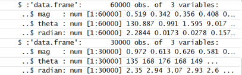
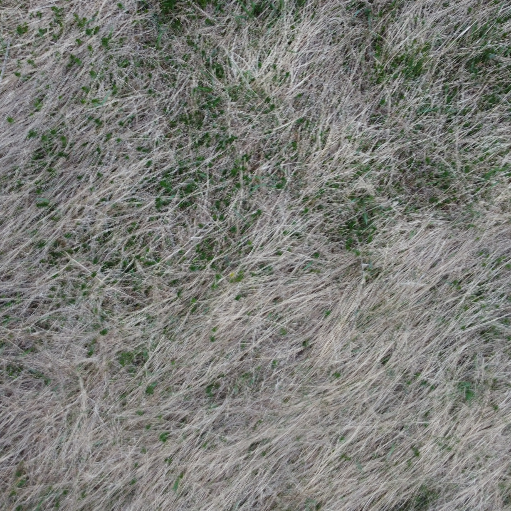
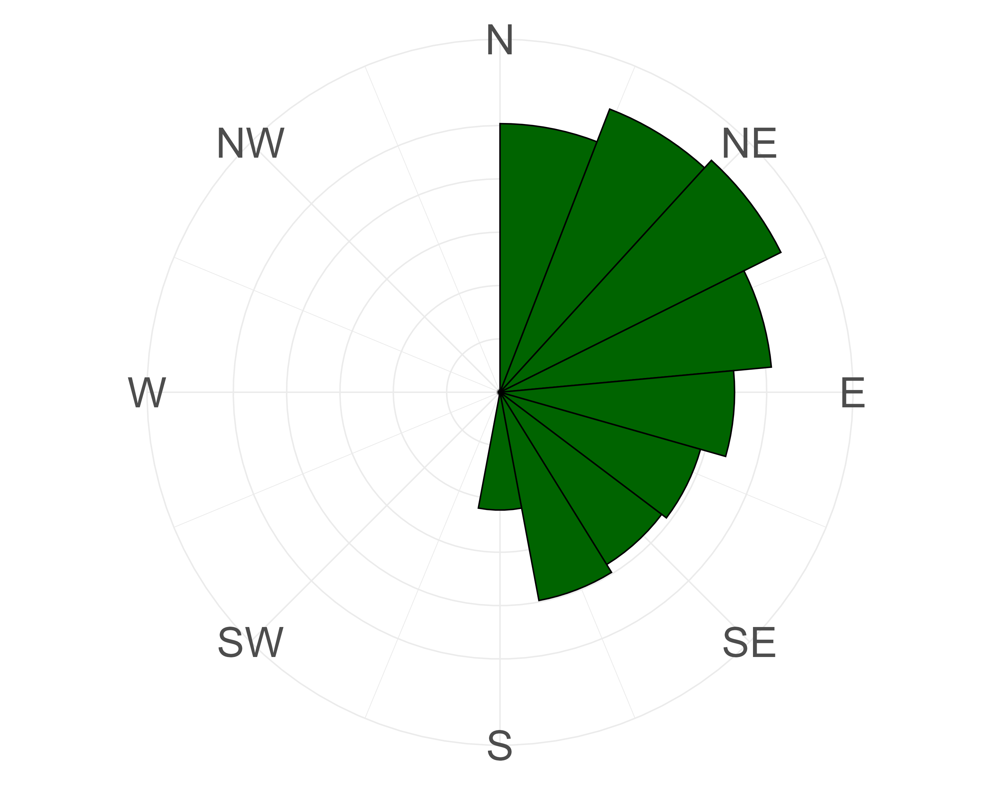
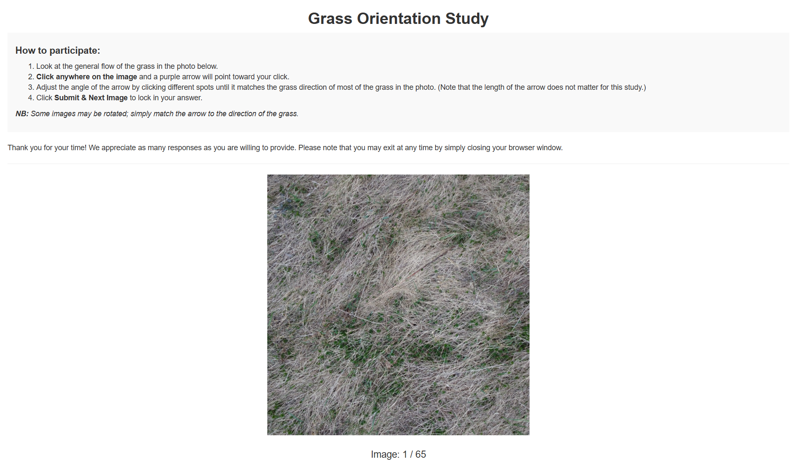
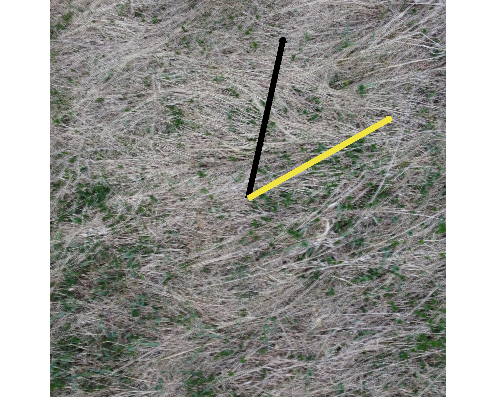
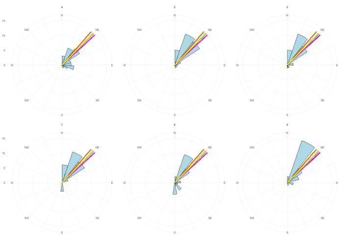

## 1. Introduction

In Arctic communities, residents have long relied on Traditional Ecological Knowledge (TEK), in particular, physically observing how grass lays, to guide hunting activities. However, changes in climate and a lack of historical wind data in harsh weather conditions have made patterns associated with TEK harder to predict and keep track of. By investigating grass image analysis using data science methods, we hope to discover potential ways to support and recalibrate this type of TEK for a community to track shifts in wind direction that affect hunting, travel, settlement patterns, and generally being able to know their land. 

We use image gradient analysis that draws on components of the Histogram of Oriented Gradients (HOG) algorithm, to estimate grass orientation from tundra grass images collected at the St. Lawrence University Living Laboratory (SLU Living Lab). The results of this gradient analysis are compared with human assessments of grass orientation to evaluate how closely the algorithm matches what people identify as the dominant grass direction in an image. This comparison allows us to assess the algorithm’s ability to recover grass orientation from grass images relative to human assessment. This automation would present a first step toward applications that could help recalibrate methods communities use to monitor changes in local wind patterns from field images in places where wind sensors cannot be used, improving research and assessment of climate-driven environmental changes.

## 2. Background

Harsh Arctic climate and wildlife make it difficult to keep weather equipment in regions like Savoonga, Alaska, making using TEK an imperative tool to measure weather patterns. Additionally, the cultural significance of TEK makes it essential to support its recalibration. TEK is defined as knowledge and practices passed from generation to generation informed by cultural memories, sensitivity to change, and values that include reciprocity. TEK observations are qualitative and long-term, often made by persons who hunt, fish, and gather for subsistence. Most importantly, TEK is inseparable from a culture’s spiritual and social fabric, offering irreplaceable ecocultural knowledge that can be thousands of years old and incorporates values, such as kinship with nature and reciprocity, that can help restore ecosystems. 

Because of the significance of TEK in Arctic communities, a project by Dr Rosales, Dr Ramler, and Dr Torrey at St. Lawrence University proposes to measure the TEK in Savoonga, AK that the prevailing wind direction changed from the historical northerly dominated winds 30 plus years ago to southerly and easterly dominated winds around St. Lawrence Island (SLI), on which Savoonga is located. This will serve to recalibrate the TEK of wind direction on SLI to restore the knowledge and practice of observing wind direction that is being lost with a changing Arctic. For this project, they are mirroring the grass grown in Alaska through tundra grasses being grown in the SLU Living Lab. In the Savoonga region, residents employ the TEK practice of observing wind dynamics affecting tundra plants and in particular they examine bluejoint reedgrass (Calamagrostis canadensis) and tall cottongrass (Eriophorum angustifolium), in the sedge family, as indicators of predominant wind direction and wind direction. Hunters and gatherers from Savoonga observe the direction these plants lay down after the growing season as proxies for predominant wind direction and wind direction change. Similarly, this project will assess tundra grasses in April 2023 and wind data from the previous year's growing season.

As part of this project, Dr. Jon Rosales and his team collected images of grass lay from the SLU Living Lab and manually attempted to measure grass lay angles and relate them with wind data. To support this process, we investigated how we can use image gradient analysis techniques on the images of tundra grass lay from the SLU Living Lab automate the process of measuring grass lay angles and relating them with wind data. This gradient analysis technique is based on some components adapted from HOG algorithm.


## 3. Data

To evaluate this gradient analysis algorithm's performance, we used 65 tundra grass images from the SLU Living Lab taken in April 2023 by Dr. Jon Rosales. The images taken were aerial images taken using a drone. There are a varied range of images from a birds-eye view to close-up shots. Increasing variability in the analysis, there are images with different kinds of noise such as obstructing objects on land and buildings. Some images had grass obviously leaning in one direction while others had an ambiguous dominant grass lay direction.

<div align="center">

  <figure style="display: inline-block; margin: 10px;">
    
    <figcaption style="text-align: center;">a&#41; Grass Image 1</figcaption>
  </figure>

  <figure style="display: inline-block; margin: 10px;">
    
    <figcaption style="text-align: center;">b&#41; Grass Image 2</figcaption>
  </figure>

  <figure style="display: inline-block; margin: 10px;">
    
    <figcaption style="text-align: center;">c&#41; Grass Image 3</figcaption>
  </figure>
  
  <p style="text-align: center; font-style: italic;">Sample St. Lawrence University Living Laboratory Drone Grass Images</p>

</div>


## 4. Methods

### a. Gradient Analysis Adapted From the Histogram of Oriented Gradients (HOG)

In a previous senior year research project, Ben Sunshine (2024) investigated the HOG algorithm to automate the measurement of grass lay angles. They applied the algorithm to various images sampled from the internet and grass images from the SLU Living Lab to test the algorithm's viability. Upon uncovering its viability, this project proceeds with adapting this algorithm's gradient analysis techniques. The HOG algorithm, is a method that is used to capture the orientation of textures in an image. The first component of the HOG algorithm is gradient analysis. An image is split into small patches called cells, and we compute the gradient magnitude and direction in each cell <a href="https://www.sciencedirect.com/topics/computer-science/histogram-of-oriented-gradient">(Manavalan, 2020)</a>. These local gradients, magnitudes, and angles are extracted and then aggregated into a vectors that describe the overall image to represent it into patterns that identify images like is shown below.

<div style="display: flex; justify-content: center; gap: 20px; align-items: flex-start;">

  <figure style="text-align: center;">
    
    <figcaption>a&#41; Input Grass Image</figcaption>
  </figure>

  <figure style="text-align: center;">
    
    <figcaption>b&#41; Grayscaled and Decomposed Grass Image</figcaption>
  </figure>
  
  <figure style="text-align: center;">
    
    <figcaption>c&#41; Snippet of Vectors Describing Grass Image</figcaption>
  </figure>

</div>

<p style="text-align: center; font-style: italic;">
  Steps of HOG Gradient Analysis
</p>


This preliminary processing of the gradient analysis included loading several R packages to support image manipulation, data handling, and statistical analysis, including tidyverse, imager, magick, circular, and exif. The raw drone images were rotated by different degrees to evaluate the consistency with varying orientations (0°, 90°, 180°, and 270°) and processed to ensure consistent gradients regardless of orientations. The processing included loading, resizing, and converting the images to grayscale. Images were rescaled to standardize their resolutions and preserve their aspect ratios to prevent distortion that could affect the accuracy of angle identification. The images were converted to grayscale to allow for focusing on representing pixel intensity, rather than the three different standard color values. 

The gradient magnitudes and angles were then computed for every pixel in the resized images. The gradient magnitude at each pixel is comprised of the gradients in the ‘x’ and ‘y’ directions. The gradient in the x-direction is computed by subtracting the pixel value to the left of pixel of interest from the pixel value to its right. Similarly, the gradient in the y-direction is calculated by subtracting the pixel value below the pixel of interest from the pixel value above the pixel of interest. 

<details>
<summary><strong>View Gradient Computation Code</strong></summary>

```r
for (i in 1:h) {
  for (j in 1:w) {

    Gx <- if (j == 1) M[i, j+1] 
          else if (j == w) -M[i, j-1] 
          else M[i, j+1] - M[i, j-1]

    Gy <- if (i == 1) -M[i+1, j] 
          else if (i == h) M[i-1, j] 
          else M[i+1, j] - M[i-1, j]

    mag <- sqrt(Gx^2 + Gy^2)

    angle <- if (Gx == 0) 0 else atan(Gy / Gx) * 180 / pi
    if (angle < 0) angle <- angle + 180

  }
}
```
</details> 

These values are then stored as vectors and structured as datasets describing each image. Because grass blades have defined, fine, and linear textures, these gradient extraction techniques effectively identify dominant directions and magnitudes. This supports our ability to capture a general trend or flow in the grass making gradient analysis useful for identifying a dominant grass lay direction. 

EXIF metadata is also extracted to retrieve timestamps, which are cleaned and converted into usable date variables to help attach identifiers to the images. To summarise these gradient values, weighted circular statistics are used. Magnitudes identified in each pixel serve as weights to compute measures such as circular mean, variance, median, and interquartile range of the angle values. These statistics are compiled across all images of the different rotations. This data is then merged with the extracted date information to produce comprehensive datasets for further analysis. A data frame consisting of image name, date taken, and circular statistics was created to understand algorithm's perceptions of the general trend and flow of grass in the 65 images. To observe how this gradient analysis visualises images, below is a side by side view of a raw grass image taken from the SLU Living Lab and a polar plot displaying the general trend and flow of grass as retrieved by the gradient analysis.

<div style="text-align: center;">

  <figure style="display: inline-block; margin: 10px;">
    
    <figcaption style="text-align: center;">a&#41; Raw Grass Image</figcaption>
  </figure>

  <figure style="display: inline-block; margin: 10px;">
    
    <figcaption style="text-align: center;">b&#41; Gradient Polar Plot</figcaption>
  </figure>
  
  <p style="text-align: center; font-style: italic;">Gradient Analysis Polar Plot Visualization</p>

</div>

As discussed earlier, the assessment of grass lay direction was previously conducted by a team of Environmental studies professionals using manual equipment. To evaluate the closeness of the general flow of grass retrieved by the gradient analysis, we obtained human assessments of the same Slu Living Lab images to validate and compares results of the findings. The next section will discuss how we retrieved human assessment of grass lay using an R Shiny Web App.

### b. Human Assessment of Grass Lay Using R Shiny Web App

A customised interactive grass app was created using R Shiny to collect human assessments of the grass images dominant grass lay direction. 45 volunteers completed the assessment of all 65 grass images. Each participant session is assigned a unique UUID to ensure anonymity while preserving response traceability. The application presents users with the series of grass images and prompts them to indicate the dominant direction of grass lay by clicking directly on the image. Upon clicking, a visual arrow is displayed to reflect the selected direction, allowing users to adjust their response before submission. 

<details>
<summary><strong>View Grass App Interface</strong></summary>

<div style="text-align: center;">

  <figure style="display: inline-block; margin: 10px;">
    
  </figure>
  
  <p style="text-align: center; font-style: italic;"><a href="https://franmnenula.shinyapps.io/grassapp_v1/">The Grass App User Interface</a></p>

</div>
</details> 

Images are stored in a GitHub repository and were retrieved using the GitHub API. This avoids the need for hardcoding file paths and ensures that the full image set can be updated. To reduce ordering effects, the image sequence is randomly shuffled independently for each participant session. Additionally, to ensure variability and reduce bias of people's understanding of northeasterly winds, images are displayed with a randomly assigned rotation (0°, 90°, 180°, or 270°). This design ensures that responses are based on perceived grass direction rather than fixed orientation.

<details>
<summary><strong>View Image Retrieval</strong></summary>
```r
# Github variables
repo_owner <- "franriee"
repo_name <- "SYE_Grass_Study"

# Use regular images folder to get the master list of filenames
folder_api <- paste0("https://api.github.com/repos/", repo_owner, "/", repo_name, "/contents/images")
files <- jsonlite::fromJSON(folder_api)

# Create a data frame to keep the image names 
img_master_global <- data.frame(
  name = files$name[grepl("\\.(png|jpg|jpeg)$", files$name, ignore.case = TRUE)], 
  stringsAsFactors = FALSE
)

# Server
server <- function(input, output, session) {
  # Create a session-specific shuffled copy of the images
  img_master <- img_master_global[sample(nrow(img_master_global)), , drop = FALSE]
  
  # Pre-assign a random rotation folder for every image for this session
  session_rotations <- sample(c(0, 90, 180, 270), nrow(img_master), replace = TRUE)

```
</details> 


Each image is displayed using a Plotly-based interface that overlays the image onto a coordinate grid ranging from 0 to 1 in both the x and y dimensions. The image itself is rendered as a background layer and Plotly uses an invisible heatmap as a structured coordinate system to capture user interaction. This design allows better recording of click positions without needing to re-render the images at each arrow iteration as is needed when using ggplot.

<details>
  <summary><strong>View Plotly Design</strong></summary>
```r
plot_ly(
      x = g, y = g, z = z,
      type = "heatmap",
      showscale = FALSE,
      hoverinfo = "none",
      source = "grass_plot",
      colorscale = list(list(0, "rgba(0,0,0,0)"), list(1, "rgba(0,0,0,0)"))
    ) %>%
      layout(
        xaxis = list(range = c(0, 1), visible = FALSE, fixedrange = TRUE),
        yaxis = list(range = c(0, 1), visible = FALSE, fixedrange = TRUE, scaleanchor = "x"),
        images = list(list(
          source = github_raw_url,
          x = 0, y = 1, sizex = 1, sizey = 1,
          xref = "x", yref = "y", sizing = "contain", layer = "below"
        )),
        margin = list(l=0, r=0, t=0, b=0),
        annotations = list() # Clear old arrows on re-render
      ) %>%
      config(displayModeBar = FALSE)
  })

```
</details> 


User responses are captured as click coordinates and angular measurements are generated relative to the center of the image. The horizontal and vertical differences from the image center are used to compute an angle using an inverse tangent function. The result is mapped onto a 0–360° circular scale, ensuring that grass orientation is treated as circular rather than linear data.

<details>
<summary><strong>View Angle Calculation</strong></summary>

```r
  
  # Listen for plotly click
  observeEvent(event_data("plotly_click", source = "grass_plot"), {
    d <- event_data("plotly_click", source = "grass_plot")
    req(d) # require that the click is not null
    
    # Update the last saved clicks
    last_click_x(d$x)
    last_click_y(d$y)
    
    # Angle calculation from center (0.5, 0.5)
    dx <- d$x - 0.5
    dy <- d$y - 0.5
    
    # Convert x,y to degrees (using atan2)
    # Gemini: R's atan2 is (y, x). Adjust the calculation to make 0 degrees "North/Up"
    res_angle <- (atan2(dx, dy) * 180 / pi) %% 360
    current_angle(res_angle)
    
    # Update arrow
    # plotlyProxy to modify only the annotation layer of the plot
    # relayout updates the arrow position instantly without re-rendering the background grass image
    plotlyProxy("img_display", session) %>%
      plotlyProxyInvoke("relayout", list(
        annotations = list(list(
          x = d$x, y = d$y,
          ax = 0.5, ay = 0.5,
          xref = "x", yref = "y",
          axref = "x", ayref = "y",
          text = "", 
          showarrow = TRUE,
          arrowwidth = 5,
          arrowhead = 3,
          arrowcolor = "#4B0082"
        ))
      ))
  })
}
```
</details> 

In addition to angular direction, the Euclidean distance from the image center is recorded for each click. which may serve as a proxy for the volunteer's response confidence and enables us to identify potentially erroneous inputs when the coordinates are at the origin and an angle was not changed at all.

<details>
<summary><strong>View Magnitude Calculation</strong></summary>

```r
 # Get the click
    cx <- last_click_x()
    cy <- last_click_y()
    dx <- cx - 0.5
    dy <- cy - 0.5
    mag <- sqrt(dx^2 + dy^2)
```
</details> 


All responses are stored in real time using the Google Sheets API, enabling immediate cloud-based logging without local storage dependencies. Each record includes a unique participant identifier, image name, displayed rotation condition, computed angle, corrected true angle that is adjusted for rotation, click coordinates, magnitude, and timestamp. This structure ensures full reproducibility and supports further statistical.  All responses, including user ID, image name, rotation, adjusted angle, and timestamp, are stored in a connected Google Sheets database via the googlesheets4 package.

<details>
<summary><strong>View Storage Management Code</strong></summary>

```r
# Google sheets connection
gs4_auth(path = "sye2026-5dd46ac66f14.json")
sheet_url <- "https://docs.google.com/spreadsheets/d/19002kMeTJ4caXqI836P4sCkHAB-WvlcL3er5T0K8E-o/edit#gid=198629460"
codes_sheet_url <- "https://docs.google.com/spreadsheets/d/1OFfgWM_in43GS-d2eNcBdeXbdbuWe0drYJy__wt1XVk/edit?gid=0#gid=0"

# Add to Google Sheet
    # Upon submission, create the row of data by creating a df
    # Make sure to retrieve the name of the image the user is seeing
    # Add the new data to the Google Sheet (sheet)
    sheet_append(sheet_url, data.frame(
      UserID = user_session_id,
      Image = img_master$name[idx()], 
      User_Angle = round(current_angle(), 2),
      True_Angle = round((current_angle() - rotation()) %% 360, 2), # reverse the rotation and that is the true angle
      Rotation = rotation(),
      Timestamp = format(Sys.time(), tz = "America/New_York"),
      Coord_x = round(cx, 4),
      Coord_y = round(cy, 4),
      Magnitude = round(mag, 2)
    ), sheet = "Results")
```
</details> 

Just like with the gradient analysis results, to summarise the results submitted by these volunteer respondents, we calculated circular statistics such as mean, variance, standard deviations, and interquartile ranges. A data frame consisting of image name, date taken, and circular statistics was created to understand human perceptions of the general trend and flow of grass in the 65 images.

The findings from both the gradient analysis techniques and the human assessment of images were compared to evaluate the validity of results obtained from the gradient analysis techniques. The next section will highlight the results compared as well as assess this data's association with wind data during the growing season the previous year. 

## 5. Results

### a. Compare Results Between Gradient Analysis and Human Assessment

To evaluate the differences between the results from the Gradient Analysis and Human Assessment, we computed the circular distances between the two methods' circular means that entailed dominant direction of grass obtained from images using both techniques. 

<details>
<summary><strong>View How Differences In Circular Mean Were Calculated</strong></summary>

```r
# Calculate distances between human vs hog
diff_df <- data.frame(
  image = hog_df$image_name,
  human_angle = human_df$circular_mean,
  hog_angle = hog_df$circular_mean,
  circular_distance = circular_distance(human_df$circular_mean, hog_df$circular_mean, axial = TRUE, na.rm = TRUE))

diff_df

write_csv(diff_df, file.path(output_dir, "diff_df.csv"))
```

</details> 

The mean of the circular distances among all 65 images is around 0.26 with a variance of 0.09. The minimum circular distance is 0.0006 and the maximum circular distance is 0.999. There are a number of images where both the human assessment of dominant direction and gradient analysis' dominant direction closely align. However, there are also a number of images where the two techniques output vastly different results. In the image below the yellow represents dominant direction by the gradient analysis and the black by human assessment.

<div style="text-align: center;">

  <figure style="display: inline-block; margin: 10px;">
    
    <figcaption style="text-align: center;">a&#41; Low Circular Difference</figcaption>
  </figure>

  <figure style="display: inline-block; margin: 10px;">
    
    <figcaption style="text-align: center;">b&#41; High Circular Difference</figcaption>
  </figure>
  
  <p style="text-align: center; font-style: italic;">Images Showing Circular Distance</p>

</div>

There a number of reasons we assume the retrieved dominant angle differs significantly between the gradient analysis and the human assessment. The first is that the gradient analysis technique assesses all possible directions in all cells in the images. Without filtering for values of a chosen magnitude threshold, the overall circular mean and general flow assessed may be affected by insignificant values. This is an aspect that humans can simply oversee and process unlike an algorithm. More generally, is the variety of angles the images were taken from. The type of aerial photographs in this dataset were signficantly different. Some were completely overhead and others were right above the grass. Some images that did poorly were also images of poor quality such as having blurry outlines.

### b. Comparing Dominant Grass Direction and Wind Data

At the SLU Living Lab, a wind station was installed adjacent to the tundra vegetation to collect localized environmental data. The station records multiple wind-related variables, including wind speed and direction, at 15-minute intervals. For this analysis, these measurements were aggregated into daily averages. This enables a direct comparison between prevailing wind patterns and the dominant grass orientation extracted from both human responses and the gradient analysis methods, forming the basis for evaluating how grass lay direction can be recalibrated as a reliable proxy for wind behavior. The dataset was cleaned and restructured to extract timestamp information, derive a date-only variable for aggregation, and keep the relevant directional and speed measurements. To capture the strongest wind each day, we extracted the wind direction at the time of maximum wind speed. This represents the most intense wind event of the day, which is likely to have the greatest effect on bending or shifting grass.

Nine representative images were selected where human assessments and Gradient Analysis estimates showed the smallest angular differences. The gradient analysis dominant grass lay directions of these images were then aligned with the corresponding wind data from April 2022 to February 2022 to evaluate how grass orientation relates to observed environmental conditions during the growing season of the tundra plants that are falling by April 2023. This analysis assessed whether grass lay direction in these high-agreement cases corresponds to prevailing wind patterns. In the image below, it is evident that dominant grass direction from the selected nine images aligns well in all months especially in the Spring when the growing season of the grass is.

<div style="text-align: center;">

  <figure style="display: inline-block; margin: 10px;">
    
  </figure>
  
  <p style="text-align: center; font-style: italic;">Wind Data and Image Dominant Grass Lay</p>

</div>


## 6. Conclusion

Overall, we find that in several images there is strong agreement between human assessments and gradient-based estimates of dominant grass direction. In these cases, both methods produce similar results, suggesting that they can successfully capture the main direction of grass lay from images. When compared with wind data, this alignment is strongest in the spring season, which is the main growing period for tundra grass. During this time, the grass is more flexible and responsive to environmental conditions, making patterns of alignment easier to detect.

However, there are still important cases where human assessments and gradient-based methods do not agree suggesting that both approaches may have limitations. Human assessments can be affected by how clear or complex the image is, while gradient methods can be influenced by image noise, texture, or lighting conditions, thus need a lot of algorithmic fine tuning. Because of this, further work is needed to understand when each method performs well and when it fails.

One important next step is to develop clearer guidelines for how field images should be collected using drones. Image quality, camera angle, altitude, and lighting conditions can all affect how clearly vegetation direction can be detected. Standardizing these factors would help reduce variability in both human and computational assessments and improve the reliability of comparisons. This project could also be expanded beyond tundra grass to other vegetation types that may also respond to wind aligning with a different season of the year.

Future analysis should also focus on disagreement cases in more detail to show when vegetation direction is not a reliable indicator of wind, or when one method is more accurate than the other. It would also be useful to compare results across different years, such as using 2023 wind data and 2024 grass images, to test whether these patterns stay consistent over time and under different environmental conditions.

These findings could be applied to supporting and strengthening Traditional Ecological Knowledge (TEK) in Savoonga, Alaska. TEK relies on long-term observation of natural indicators, including how vegetation lays in response to wind, to understand environmental change. By developing methods that can estimate vegetation orientation from images and compare it with wind data, this work aims to help recalibrate and support these traditional observations in the context of a changing Arctic. More broadly, this framework could support community-based environmental monitoring tools that help track changes in wind patterns in regions where direct weather equipment and measurements are limited.

There is also potential for practical application beyond research. A simple web-based tool could allow users, such as small-scale farmers or local observers, to upload field images and estimate local wind direction to inform decisions such as placing wind barriers or understanding field conditions. In such a system, it is not yet clear whether human crowd-sourcing or automated gradient analysis would be more effective. Human input may capture contextual and traditional knowledge, while gradient-based methods offer consistency and better scalability. The best approach likely depends on the use case and environment.

These results have shown promising agreement between human perception, computational methods, and wind data in certain conditions. At the same time, they highlight the importance of improving data collection practices, understanding sources of disagreement, and expanding fine-tuning goals. Together, these steps move toward a more robust framework for linking image-based vegetation analysis with environmental wind patterns in support of both scientific understanding and Traditional Ecological Knowledge.


